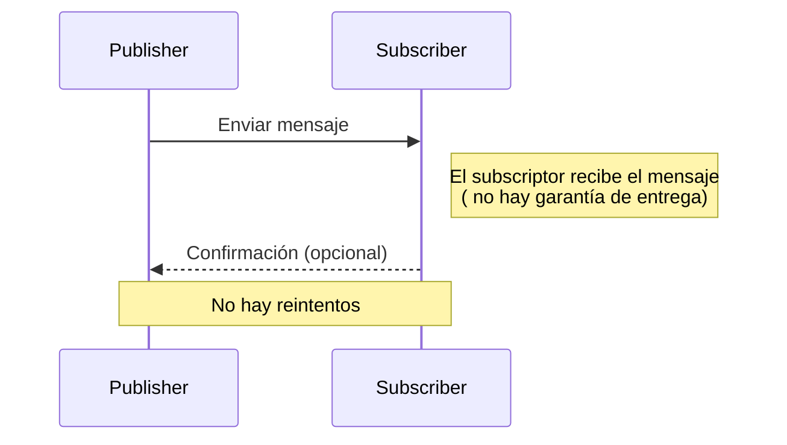

# Semántica de como mucho una vez (at-most-once semantics)

Este es el tipo más simple de lograr, pero ofrece las garantías menos deseables. En este escenario:

- Cada mensaje se entrega una vez (en el mejor de los casos) o no se entrega en absoluto.
- No hay una garantía absoluta de entrega de mensajes.
- Los componentes en el sistema no necesitan mantener un estado.
- A menudo se utiliza en escenarios de tipo "enviar y olvidar" (Fire & Forget), donde perder un mensaje es aceptable.



### Ejemplo de semántica de como mucho una vez en Redis

En Redis, la semántica de como mucho una vez se puede lograr utilizando PubSub. Al publicar un mensaje en un canal, el mensaje se entrega a todos los suscriptores. Sin embargo, si un suscriptor no está disponible en el momento de la publicación, el mensaje se pierde. No hay garantía de que el mensaje se entregue a todos los suscriptores. 

1. Configuración del Publicador
El publicador será responsable de enviar mensajes al canal sin preocuparse por si el mensaje ha sido recibido o no, lo cual se alinea con la semántica de como mucho una vez.

```csharp
using StackExchange.Redis;
using System;

class Publisher
{
    static void Main(string[] args)
    {
        ConnectionMultiplexer redis = ConnectionMultiplexer.Connect("redis-db");
        ISubscriber sub = redis.GetSubscriber();

        string channel = "testChannel";
        string message = "Hello, World!";

        // Publicar el mensaje
        sub.Publish(channel, message);
        Console.WriteLine("Mensaje publicado: " + message);

        // Cerrar la conexión
        redis.Close();
    }
}
```

2. Configuración del Suscriptor
El suscriptor escuchará los mensajes en el canal especificado y procesará cada mensaje a medida que llegue, sin garantías de que el mensaje no se pierda si el suscriptor no está conectado o disponible.

```csharp
using StackExchange.Redis;
using System;

class Subscriber
{
    static void Main(string[] args)
    {
        ConnectionMultiplexer redis = ConnectionMultiplexer.Connect("localhost");
        ISubscriber sub = redis.GetSubscriber();

        string channel = "testChannel";

        // Suscribirse al canal y recibir mensajes.
        sub.Subscribe(channel, (ch, msg) => {
            Console.WriteLine("Mensaje recibido: " + msg);
        });

        Console.WriteLine("Suscripto al canal: " + channel);
        Console.ReadLine(); // Mantener la aplicación en ejecución para recibir mensajes

        // Cerrar la conexión
        redis.Close();
    }
}
```

#### Funcionamiento y Consideraciones

- **Publicador**: Envía mensajes al canal especificado. Los mensajes son enviados sin verificar si hay suscriptores activos o si el mensaje es recibido, lo cual es típico de la semántica de como mucho una vez.

- **Suscriptor**: Escucha y reacciona a los mensajes a medida que son publicados en el canal. Si el suscriptor está desconectado cuando se envían mensajes, esos mensajes se perderán para él, ya que Redis no almacena los mensajes publicados para entrega futura a nuevos suscriptores.


> Este ejemplo es simple y demuestra el uso básico del modelo pub/sub en Redis con la semántica de como mucho una vez, ideal para casos donde es aceptable perder mensajes.


# Referencias

- [Redis: Libraries and tools](https://redis.io/docs/latest/integrate/)

- [Rediis: C#/.NET guide](https://redis.io/docs/latest/develop/connect/clients/dotnet/)

- [Redis: Transactions](https://redis.io/docs/latest/develop/interact/transactions/)

- [Redis: Pub/Sub](https://redis.io/docs/latest/develop/streams/pubsub/)

- [StackExchange.Redis: Github](https://github.com/StackExchange/StackExchange.Redis)

- [StackExchange.Redis: Pipelines and Multiplexers](https://github.com/StackExchange/StackExchange.Redis/blob/main/docs/PipelinesMultiplexers.md)

- [StackExchange.Redis: Transactions](https://github.com/StackExchange/StackExchange.Redis/blob/main/docs/Transactions.md)

- [Build an Async Queue System using Redis & ASP.NET](https://medium.com/@tepes_alexandru/build-an-async-queue-system-using-redis-asp-net-046f1a42bb27)

- [Redis Queue With Threads](https://github.com/Glenadam15/Redis_QueuewithThreads/blob/master/Program.cs)

[back to home](../README.md)