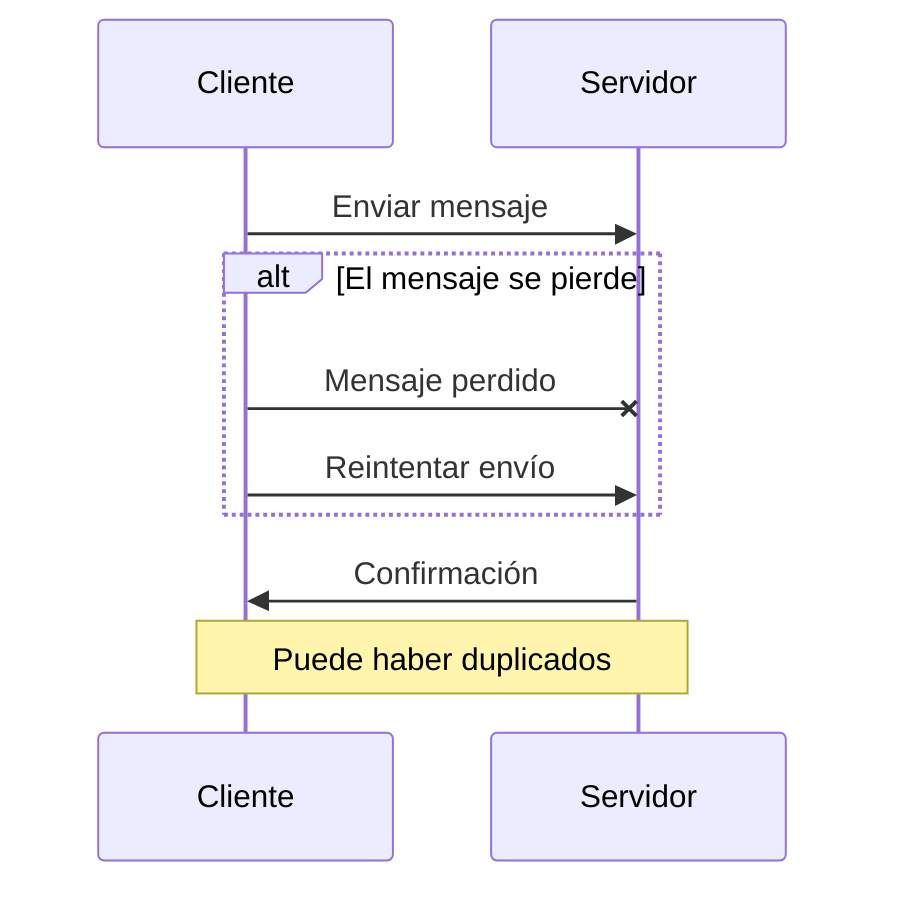

# Semántica de al menos una vez (at-least-once semantics)

Una mejora sobre la semántica de como mucho una vez, este enfoque asegura que al menos un intento de entrega sea exitoso:

- Podría haber múltiples intentos para entregar un mensaje.
- Aunque es posible la duplicación de mensajes, estos no pueden perderse.
- Útil en casos donde la duplicación de datos no es crítica o puede realizarse una deduplicación en el lado del consumidor.



### Ejemplo de semántica de de al menos una vez en Redis

En Redis, la semántica de de al menos una vez se puede lograr utilizando PubSub. Al publicar un mensaje en un canal, el mensaje se entrega a todos los suscriptores. Sin embargo, si un suscriptor no está disponible en el momento de la publicación, el mensaje se pierde. No hay garantía de que el mensaje se entregue a todos los suscriptores. 

1. Configuración del Productor
El productor debería intentar reenviar mensajes si no recibe una confirmación de éxito del consumidor en un tiempo determinado.

```csharp
using StackExchange.Redis;
using System;
using System.Threading.Tasks;

class Producer
{
    static async Task Main(string[] args)
    {
        ConnectionMultiplexer redis = ConnectionMultiplexer.Connect("localhost");
        ISubscriber sub = redis.GetSubscriber();

        string channel = "reliableChannel";
        string message = "Important Message";

        // Intentar enviar el mensaje múltiples veces hasta que se reciba confirmación
        bool isAcknowledged = false;
        int retryLimit = 5;
        int attempts = 0;

        while (!isAcknowledged && attempts < retryLimit)
        {
            long receivers = sub.Publish(channel, message);
            if (receivers > 0)
            {
                isAcknowledged = true;
                Console.WriteLine("Mensaje entregado a {0} suscriptores.", receivers);
            }
            else
            {
                Console.WriteLine("No se detectaron suscriptores, reintentando...");
                await Task.Delay(1000); // Esperar un segundo antes de reintentar
                attempts++;
            }
        }

        if (!isAcknowledged)
        {
            Console.WriteLine("No se pudo confirmar la entrega del mensaje después de {0} intentos.", retryLimit);
        }

        // Cerrar la conexión
        redis.Close();
    }
}
```
> Nota: tenemos en cuenta que si no es un cluster, podemos saber cuantos suscriptores recibieron el mensaje.
```csharp
        /// <summary>
        /// Posts a message to the given channel.
        /// </summary>
        /// <param name="channel">The channel to publish to.</param>
        /// <param name="message">The message to send.</param>
        /// <param name="flags">The flags to use for this operation.</param>
        /// <returns>
        /// The number of clients that received the message *on the destination server*,
        /// note that this doesn't mean much in a cluster as clients can get the message through other nodes.
        /// </returns>
        /// <remarks><seealso href="https://redis.io/commands/publish"/></remarks>
        long Publish(RedisChannel channel, RedisValue message, CommandFlags flags = CommandFlags.None);
```

2. Configuración del Consumidor
El consumidor debe estar preparado para manejar mensajes duplicados, ya que bajo la semántica de al menos una vez, es posible recibir el mismo mensaje más de una vez.

```csharp
using StackExchange.Redis;
using System;

class Subscriber
{
    static void Main(string[] args)
    {
        ConnectionMultiplexer redis = ConnectionMultiplexer.Connect("localhost");
        ISubscriber sub = redis.GetSubscriber();

        string channel = "testChannel";

        // Suscribirse al canal y recibir mensajes.
        sub.Subscribe(channel, (ch, msg) => {
            Console.WriteLine("Mensaje recibido: " + msg);
        });

        Console.WriteLine("Suscripto al canal: " + channel);
        Console.ReadLine(); // Mantener la aplicación en ejecución para recibir mensajes

        // Cerrar la conexión
        redis.Close();
    }
}
```

#### Funcionamiento y Consideraciones

- Productor: Publica mensajes y verifica si hay suscriptores conectados. Reintenta enviar el mensaje si no hay suscriptores o si no recibe una confirmación en el tiempo esperado.

- Consumidor: Recibe mensajes y los procesa. Debe ser capaz de manejar la posibilidad de recibir mensajes duplicados debido a los reintentos del productor.


# Referencias

- [Redis: Libraries and tools](https://redis.io/docs/latest/integrate/)

- [Rediis: C#/.NET guide](https://redis.io/docs/latest/develop/connect/clients/dotnet/)

- [Redis: Transactions](https://redis.io/docs/latest/develop/interact/transactions/)

- [Redis: Pub/Sub](https://redis.io/docs/latest/develop/streams/pubsub/)

- [StackExchange.Redis: Github](https://github.com/StackExchange/StackExchange.Redis)

- [StackExchange.Redis: Pipelines and Multiplexers](https://github.com/StackExchange/StackExchange.Redis/blob/main/docs/PipelinesMultiplexers.md)

- [StackExchange.Redis: Transactions](https://github.com/StackExchange/StackExchange.Redis/blob/main/docs/Transactions.md)

- [Build an Async Queue System using Redis & ASP.NET](https://medium.com/@tepes_alexandru/build-an-async-queue-system-using-redis-asp-net-046f1a42bb27)

- [Redis Queue With Threads](https://github.com/Glenadam15/Redis_QueuewithThreads/blob/master/Program.cs)

[back to home](../README.md)