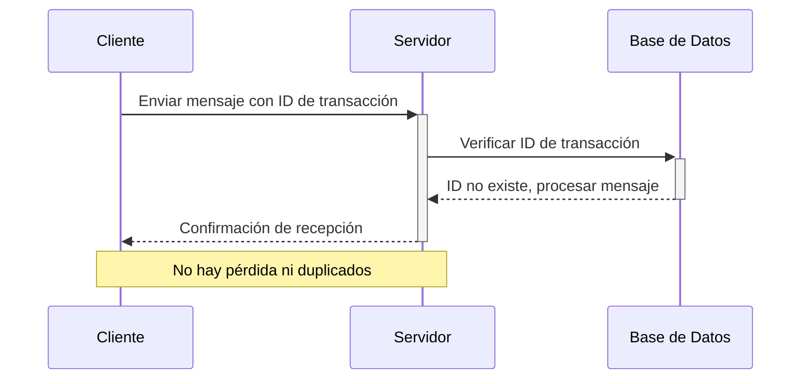

## Semántica de exactamente una vez (exactly-once semantics)

El estándar para la integridad de los datos:

- Cada mensaje se entrega precisamente una vez.
- No hay pérdida ni entrega duplicada.
- Lograr la semántica de exactamente una vez es un desafío pero ofrece la garantía más confiable.



Estas semanticas las observamos en otros contextos, como en la entrega de mensajes en sistemas de mensajería, en la replicación de bases de datos, en la sincronización de datos entre sistemas, etc.

https://docs.aws.amazon.com/step-functions/latest/dg/express-at-least-once-execution.html

### Multiplexación en Redis 
La canalización está muy bien, pero a menudo cualquier bloque de código solo quiere un solo valor (o tal vez quiera realizar algunas operaciones, pero que dependen unas de otras). Esto significa que todavía tenemos el problema de que pasamos la mayor parte de nuestro tiempo esperando que los datos se transfieran entre el cliente y el servidor. 

Ahora considere una aplicación ocupada, tal vez un servidor web. Por lo general, estas aplicaciones son inherentemente simultáneas, por lo que si tiene 20 solicitudes de aplicaciones paralelas que requieren datos, puede pensar en poner en marcha 20 conexiones o puede sincronizar el acceso a una sola conexión (lo que significaría que el último llamador tendría que esperar la latencia de las otras 19 antes de que se inicie). O como compromiso, tal vez un grupo de 5 conexiones que se alquilan, no importa cómo lo haga, habrá mucha espera. StackExchange.Redis no hace esto; En cambio, hace mucho trabajo para que usted haga un uso efectivo de todo este tiempo de inactividad mediante la multiplexación de una sola conexión. Cuando lo usan simultáneamente diferentes llamadores, canaliza automáticamente las solicitudes independientes, por lo que, independientemente de si las solicitudes usan el bloqueo o el acceso asincrónico, todo el trabajo se canaliza. Por lo tanto, podríamos tener 10 o 20 de nuestro escenario "obtener a y b" de antes (de diferentes solicitudes de aplicación), y todos entrarían en la conexión lo antes posible. Esencialmente, llena el tiempo con el trabajo de otras personas que llaman.waiting

Las únicas características de Redis que StackExchange.Redis no ofrece (y nunca ofrecerá) son los "pops de bloqueo" (BLPOP, BRPOP y BRPOPLPUSH), ya que esto permitiría que un solo llamador detenga todo el multiplexor, bloqueando a todos los demás llamadores. El único otro momento en el que StackExchange.Redis necesita retener el trabajo es cuando se comprueban las condiciones previas de una transacción, por lo que StackExchange.Redis encapsula dichas condiciones en instancias administradas internamente. Lea más sobre las transacciones aquí. Si crees que quieres "bloquear pops", te sugiero encarecidamente que consideres pub/sub en su lugar:Condition

```csharp
sub.Subscribe(channel, delegate {
    string work = db.ListRightPop(key); // tomamos el elemento final de la cola
    if (work != null) Process(work);
});
//...
db.ListLeftPush(key, newWork, flags: CommandFlags.FireAndForget); // insertamos un nuevo elemento al inicio de la lista
sub.Publish(channel, "");
```

De este modo, se consigue la misma intención sin necesidad de operaciones de bloqueo. Notas:

- Los datos no se envían a través de Pub/Sub; la API de pub/sub solo se usa para notificar a los trabajadores que comprueben si hay más trabajo
- si no hay trabajadores, los nuevos elementos permanecen almacenados en búfer en la lista; El trabajo no cae al suelo
- solo un trabajador puede extraer un solo valor; Cuando hay más consumidores que productores, algunos consumidores serán notificados y luego se darán cuenta de que no hay nada que hacer
- Al reiniciar un trabajo, debe suponer que hay trabajo para procesar cualquier trabajo pendiente
- Pero aparte de eso, la semántica es idéntica a la de bloquear pops

La naturaleza multiplexada de StackExchange.Redis permite alcanzar un rendimiento extremadamente alto en una sola conexión mientras se utiliza código normal y sin complicaciones.

# Referencias

- [Redis: Libraries and tools](https://redis.io/docs/latest/integrate/)

- [Rediis: C#/.NET guide](https://redis.io/docs/latest/develop/connect/clients/dotnet/)

- [Redis: Transactions](https://redis.io/docs/latest/develop/interact/transactions/)

- [Redis: Pub/Sub](https://redis.io/docs/latest/develop/streams/pubsub/)

- [StackExchange.Redis: Github](https://github.com/StackExchange/StackExchange.Redis)

- [StackExchange.Redis: Pipelines and Multiplexers](https://github.com/StackExchange/StackExchange.Redis/blob/main/docs/PipelinesMultiplexers.md)

- [StackExchange.Redis: Transactions](https://github.com/StackExchange/StackExchange.Redis/blob/main/docs/Transactions.md)

- [Build an Async Queue System using Redis & ASP.NET](https://medium.com/@tepes_alexandru/build-an-async-queue-system-using-redis-asp-net-046f1a42bb27)

- [Redis Queue With Threads](https://github.com/Glenadam15/Redis_QueuewithThreads/blob/master/Program.cs)

[back to home](../README.md)