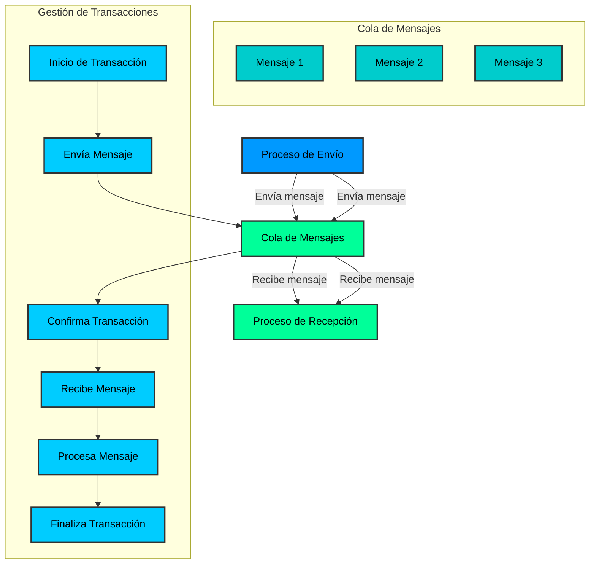
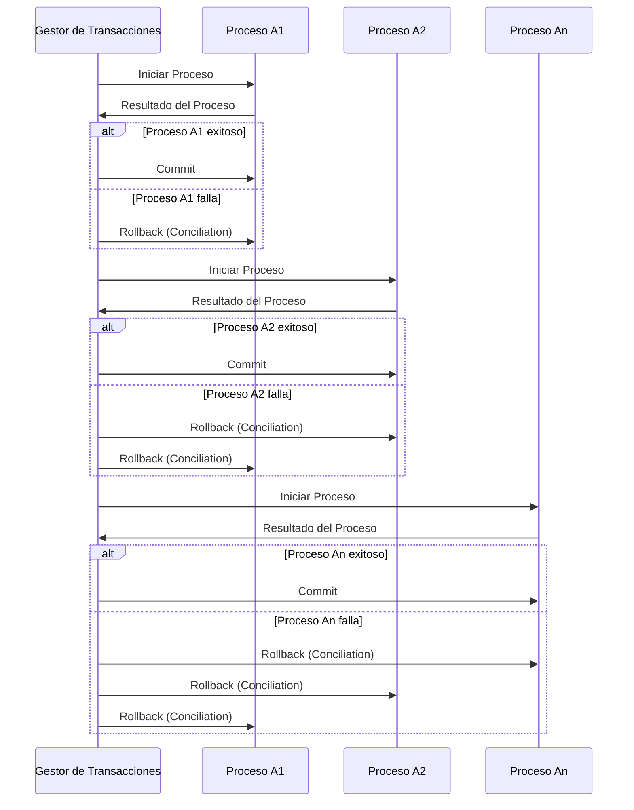

# Transacciones en Redis

Las transacciones en Redis permiten agrupar un conjunto de comandos en una única operación atómica. Esto significa que todos los comandos en la transacción se ejecutarán como una sola unidad, garantizando que no se interrumpan entre sí. Si alguno de los comandos falla, se deshacen todos los cambios realizados hasta ese momento.

Las transacciones en Redis se pueden iniciar con el comando `MULTI`, seguido de una serie de comandos, y se pueden ejecutar con el comando `EXEC`. También se pueden descartar con el comando `DISCARD`.

# Referencias

- [Redis: Libraries and tools](https://redis.io/docs/latest/integrate/)

- [Rediis: C#/.NET guide](https://redis.io/docs/latest/develop/connect/clients/dotnet/)

- [Redis: Transactions](https://redis.io/docs/latest/develop/interact/transactions/)

- [Redis: Pub/Sub](https://redis.io/docs/latest/develop/streams/pubsub/)

- [StackExchange.Redis: Github](https://github.com/StackExchange/StackExchange.Redis)

- [StackExchange.Redis: Pipelines and Multiplexers](https://github.com/StackExchange/StackExchange.Redis/blob/main/docs/PipelinesMultiplexers.md)

- [StackExchange.Redis: Transactions](https://github.com/StackExchange/StackExchange.Redis/blob/main/docs/Transactions.md)

- [Build an Async Queue System using Redis & ASP.NET](https://medium.com/@tepes_alexandru/build-an-async-queue-system-using-redis-asp-net-046f1a42bb27)

- [Redis Queue With Threads](https://github.com/Glenadam15/Redis_QueuewithThreads/blob/master/Program.cs)

[back to home](../README.md)

