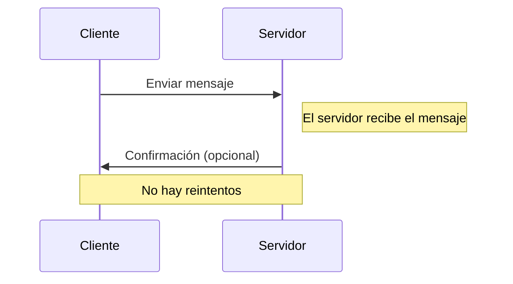
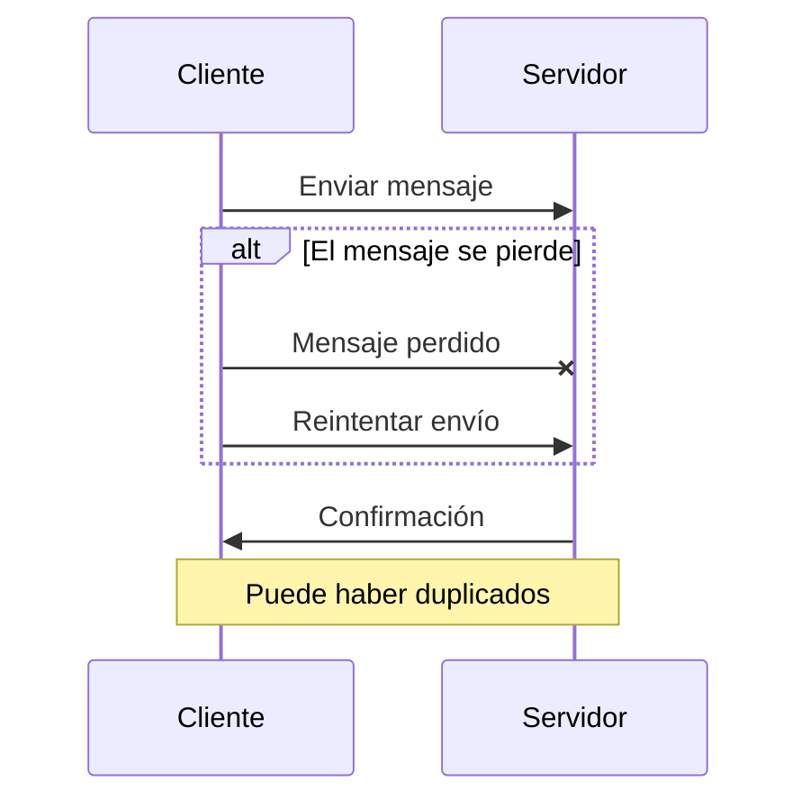
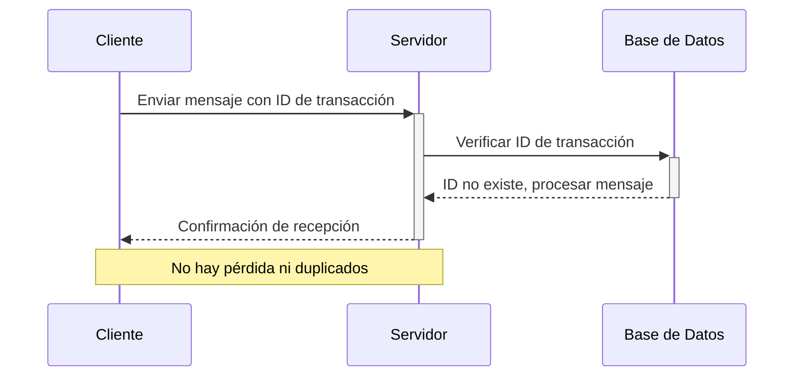

## Semántica de como mucho una vez (at-most-once semantics)

Este es el tipo más simple de lograr, pero ofrece las garantías menos deseables. En este escenario:

- Cada mensaje se entrega una vez (en el mejor de los casos) o no se entrega en absoluto.
- No hay una garantía absoluta de entrega de mensajes.
- Los componentes en el sistema no necesitan mantener un estado.
- A menudo se utiliza en escenarios de tipo "enviar y olvidar" (Fire & Forget), donde perder un mensaje es aceptable.



### Ejemplo de semántica de como mucho una vez en Redis

En Redis, la semántica de como mucho una vez se puede lograr utilizando PubSub. Al publicar un mensaje en un canal, el mensaje se entrega a todos los suscriptores. Sin embargo, si un suscriptor no está disponible en el momento de la publicación, el mensaje se pierde. No hay garantía de que el mensaje se entregue a todos los suscriptores. 

1. Configuración del Publicador
El publicador será responsable de enviar mensajes al canal sin preocuparse por si el mensaje ha sido recibido o no, lo cual se alinea con la semántica de como mucho una vez.

```csharp
using StackExchange.Redis;
using System;

class Publisher
{
    static void Main(string[] args)
    {
        ConnectionMultiplexer redis = ConnectionMultiplexer.Connect("redis-db");
        ISubscriber sub = redis.GetSubscriber();

        string channel = "testChannel";
        string message = "Hello, World!";

        // Publicar el mensaje
        sub.Publish(channel, message);
        Console.WriteLine("Mensaje publicado: " + message);

        // Cerrar la conexión
        redis.Close();
    }
}
```

2. Configuración del Suscriptor
El suscriptor escuchará los mensajes en el canal especificado y procesará cada mensaje a medida que llegue, sin garantías de que el mensaje no se pierda si el suscriptor no está conectado o disponible.

```csharp
using StackExchange.Redis;
using System;

class Subscriber
{
    static void Main(string[] args)
    {
        ConnectionMultiplexer redis = ConnectionMultiplexer.Connect("localhost");
        ISubscriber sub = redis.GetSubscriber();

        string channel = "testChannel";

        // Suscribirse al canal y recibir mensajes.
        sub.Subscribe(channel, (ch, msg) => {
            Console.WriteLine("Mensaje recibido: " + msg);
        });

        Console.WriteLine("Suscripto al canal: " + channel);
        Console.ReadLine(); // Mantener la aplicación en ejecución para recibir mensajes

        // Cerrar la conexión
        redis.Close();
    }
}
```

#### Funcionamiento y Consideraciones

- **Publicador**: Envía mensajes al canal especificado. Los mensajes son enviados sin verificar si hay suscriptores activos o si el mensaje es recibido, lo cual es típico de la semántica de como mucho una vez.

- **Suscriptor**: Escucha y reacciona a los mensajes a medida que son publicados en el canal. Si el suscriptor está desconectado cuando se envían mensajes, esos mensajes se perderán para él, ya que Redis no almacena los mensajes publicados para entrega futura a nuevos suscriptores.


> Este ejemplo es simple y demuestra el uso básico del modelo pub/sub en Redis con la semántica de como mucho una vez, ideal para casos donde es aceptable perder mensajes.


## Semántica de al menos una vez (at-least-once semantics)

Una mejora sobre la semántica de como mucho una vez, este enfoque asegura que al menos un intento de entrega sea exitoso:

- Podría haber múltiples intentos para entregar un mensaje.
- Aunque es posible la duplicación de mensajes, estos no pueden perderse.
- Útil en casos donde la duplicación de datos no es crítica o puede realizarse una deduplicación en el lado del consumidor.



### Ejemplo de semántica de de al menos una vez en Redis

En Redis, la semántica de de al menos una vez se puede lograr utilizando PubSub. Al publicar un mensaje en un canal, el mensaje se entrega a todos los suscriptores. Sin embargo, si un suscriptor no está disponible en el momento de la publicación, el mensaje se pierde. No hay garantía de que el mensaje se entregue a todos los suscriptores. 

1. Configuración del Productor
El productor debería intentar reenviar mensajes si no recibe una confirmación de éxito del consumidor en un tiempo determinado.

```csharp
using StackExchange.Redis;
using System;
using System.Threading.Tasks;

class Producer
{
    static async Task Main(string[] args)
    {
        ConnectionMultiplexer redis = ConnectionMultiplexer.Connect("localhost");
        ISubscriber sub = redis.GetSubscriber();

        string channel = "reliableChannel";
        string message = "Important Message";

        // Intentar enviar el mensaje múltiples veces hasta que se reciba confirmación
        bool isAcknowledged = false;
        int retryLimit = 5;
        int attempts = 0;

        while (!isAcknowledged && attempts < retryLimit)
        {
            long receivers = sub.Publish(channel, message);
            if (receivers > 0)
            {
                isAcknowledged = true;
                Console.WriteLine("Mensaje entregado a {0} suscriptores.", receivers);
            }
            else
            {
                Console.WriteLine("No se detectaron suscriptores, reintentando...");
                await Task.Delay(1000); // Esperar un segundo antes de reintentar
                attempts++;
            }
        }

        if (!isAcknowledged)
        {
            Console.WriteLine("No se pudo confirmar la entrega del mensaje después de {0} intentos.", retryLimit);
        }

        // Cerrar la conexión
        redis.Close();
    }
}
```
> Nota: tenemos en cuenta que si no es un cluster, podemos saber cuantos suscriptores recibieron el mensaje.
```csharp
        /// <summary>
        /// Posts a message to the given channel.
        /// </summary>
        /// <param name="channel">The channel to publish to.</param>
        /// <param name="message">The message to send.</param>
        /// <param name="flags">The flags to use for this operation.</param>
        /// <returns>
        /// The number of clients that received the message *on the destination server*,
        /// note that this doesn't mean much in a cluster as clients can get the message through other nodes.
        /// </returns>
        /// <remarks><seealso href="https://redis.io/commands/publish"/></remarks>
        long Publish(RedisChannel channel, RedisValue message, CommandFlags flags = CommandFlags.None);
```

2. Configuración del Consumidor
El consumidor debe estar preparado para manejar mensajes duplicados, ya que bajo la semántica de al menos una vez, es posible recibir el mismo mensaje más de una vez.

```csharp
using StackExchange.Redis;
using System;

class Subscriber
{
    static void Main(string[] args)
    {
        ConnectionMultiplexer redis = ConnectionMultiplexer.Connect("localhost");
        ISubscriber sub = redis.GetSubscriber();

        string channel = "testChannel";

        // Suscribirse al canal y recibir mensajes.
        sub.Subscribe(channel, (ch, msg) => {
            Console.WriteLine("Mensaje recibido: " + msg);
        });

        Console.WriteLine("Suscripto al canal: " + channel);
        Console.ReadLine(); // Mantener la aplicación en ejecución para recibir mensajes

        // Cerrar la conexión
        redis.Close();
    }
}
```

#### Funcionamiento y Consideraciones

- Productor: Publica mensajes y verifica si hay suscriptores conectados. Reintenta enviar el mensaje si no hay suscriptores o si no recibe una confirmación en el tiempo esperado.

- Consumidor: Recibe mensajes y los procesa. Debe ser capaz de manejar la posibilidad de recibir mensajes duplicados debido a los reintentos del productor.


## Semántica de exactamente una vez (exactly-once semantics)

El estándar para la integridad de los datos:

- Cada mensaje se entrega precisamente una vez.
- No hay pérdida ni entrega duplicada.
- Lograr la semántica de exactamente una vez es un desafío pero ofrece la garantía más confiable.



Estas semanticas las observamos en otros contextos, como en la entrega de mensajes en sistemas de mensajería, en la replicación de bases de datos, en la sincronización de datos entre sistemas, etc.

https://docs.aws.amazon.com/step-functions/latest/dg/express-at-least-once-execution.html

### Multiplexación en Redis 
La canalización está muy bien, pero a menudo cualquier bloque de código solo quiere un solo valor (o tal vez quiera realizar algunas operaciones, pero que dependen unas de otras). Esto significa que todavía tenemos el problema de que pasamos la mayor parte de nuestro tiempo esperando que los datos se transfieran entre el cliente y el servidor. 

Ahora considere una aplicación ocupada, tal vez un servidor web. Por lo general, estas aplicaciones son inherentemente simultáneas, por lo que si tiene 20 solicitudes de aplicaciones paralelas que requieren datos, puede pensar en poner en marcha 20 conexiones o puede sincronizar el acceso a una sola conexión (lo que significaría que el último llamador tendría que esperar la latencia de las otras 19 antes de que se inicie). O como compromiso, tal vez un grupo de 5 conexiones que se alquilan, no importa cómo lo haga, habrá mucha espera. StackExchange.Redis no hace esto; En cambio, hace mucho trabajo para que usted haga un uso efectivo de todo este tiempo de inactividad mediante la multiplexación de una sola conexión. Cuando lo usan simultáneamente diferentes llamadores, canaliza automáticamente las solicitudes independientes, por lo que, independientemente de si las solicitudes usan el bloqueo o el acceso asincrónico, todo el trabajo se canaliza. Por lo tanto, podríamos tener 10 o 20 de nuestro escenario "obtener a y b" de antes (de diferentes solicitudes de aplicación), y todos entrarían en la conexión lo antes posible. Esencialmente, llena el tiempo con el trabajo de otras personas que llaman.waiting

Las únicas características de Redis que StackExchange.Redis no ofrece (y nunca ofrecerá) son los "pops de bloqueo" (BLPOP, BRPOP y BRPOPLPUSH), ya que esto permitiría que un solo llamador detenga todo el multiplexor, bloqueando a todos los demás llamadores. El único otro momento en el que StackExchange.Redis necesita retener el trabajo es cuando se comprueban las condiciones previas de una transacción, por lo que StackExchange.Redis encapsula dichas condiciones en instancias administradas internamente. Lea más sobre las transacciones aquí. Si crees que quieres "bloquear pops", te sugiero encarecidamente que consideres pub/sub en su lugar:Condition

```csharp
sub.Subscribe(channel, delegate {
    string work = db.ListRightPop(key); // tomamos el elemento final de la cola
    if (work != null) Process(work);
});
//...
db.ListLeftPush(key, newWork, flags: CommandFlags.FireAndForget); // insertamos un nuevo elemento al inicio de la lista
sub.Publish(channel, "");
```

De este modo, se consigue la misma intención sin necesidad de operaciones de bloqueo. Notas:

- Los datos no se envían a través de Pub/Sub; la API de pub/sub solo se usa para notificar a los trabajadores que comprueben si hay más trabajo
- si no hay trabajadores, los nuevos elementos permanecen almacenados en búfer en la lista; El trabajo no cae al suelo
- solo un trabajador puede extraer un solo valor; Cuando hay más consumidores que productores, algunos consumidores serán notificados y luego se darán cuenta de que no hay nada que hacer
- Al reiniciar un trabajo, debe suponer que hay trabajo para procesar cualquier trabajo pendiente
- Pero aparte de eso, la semántica es idéntica a la de bloquear pops

La naturaleza multiplexada de StackExchange.Redis permite alcanzar un rendimiento extremadamente alto en una sola conexión mientras se utiliza código normal y sin complicaciones.

# Transacciones en Redis

# ServiceWorkers 

# Referencias

- [Redis: Libraries and tools](https://redis.io/docs/latest/integrate/)

- [Rediis: C#/.NET guide](https://redis.io/docs/latest/develop/connect/clients/dotnet/)

- [Redis: Transactions](https://redis.io/docs/latest/develop/interact/transactions/)

- [Redis: Pub/Sub](https://redis.io/docs/latest/develop/streams/pubsub/)

- [StackExchange.Redis: Github](https://github.com/StackExchange/StackExchange.Redis)

- [StackExchange.Redis: Pipelines and Multiplexers](https://github.com/StackExchange/StackExchange.Redis/blob/main/docs/PipelinesMultiplexers.md)

- [StackExchange.Redis: Transactions](https://github.com/StackExchange/StackExchange.Redis/blob/main/docs/Transactions.md)

- [Build an Async Queue System using Redis & ASP.NET](https://medium.com/@tepes_alexandru/build-an-async-queue-system-using-redis-asp-net-046f1a42bb27)

- [Redis Queue With Threads](https://github.com/Glenadam15/Redis_QueuewithThreads/blob/master/Program.cs)

[back to home](../README.md)