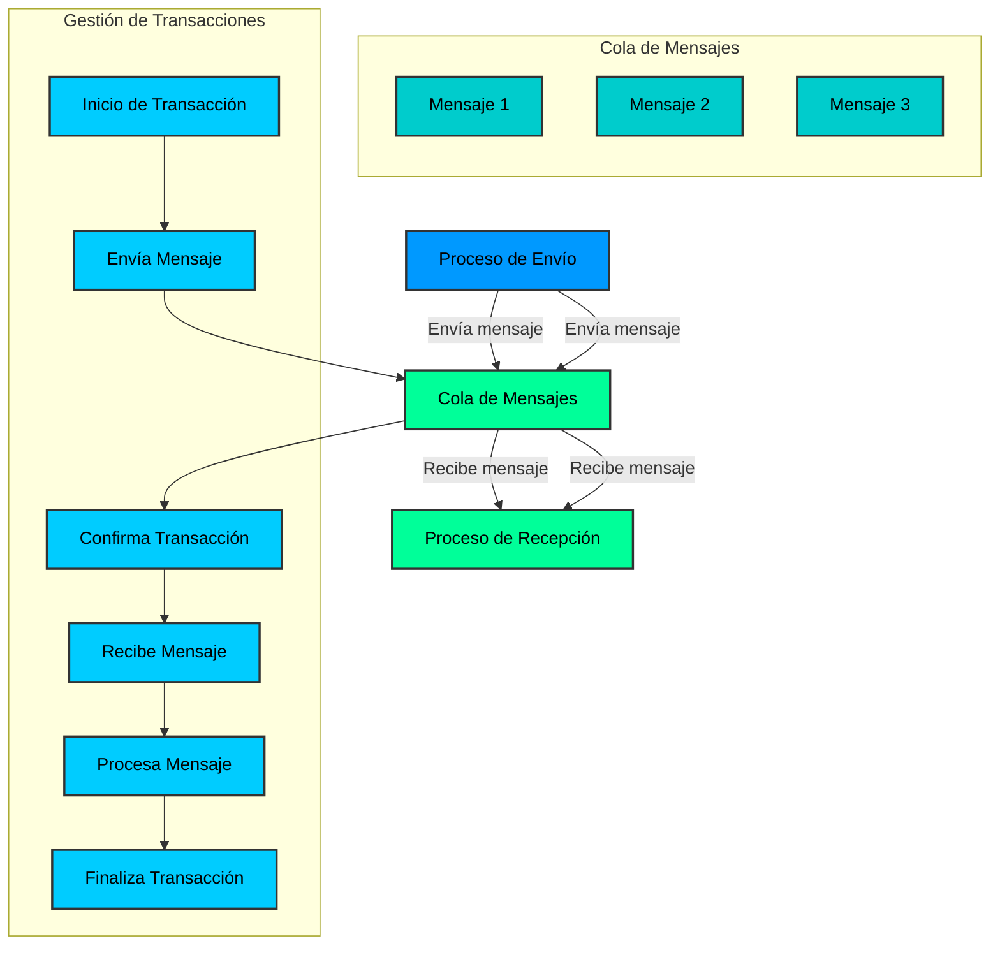
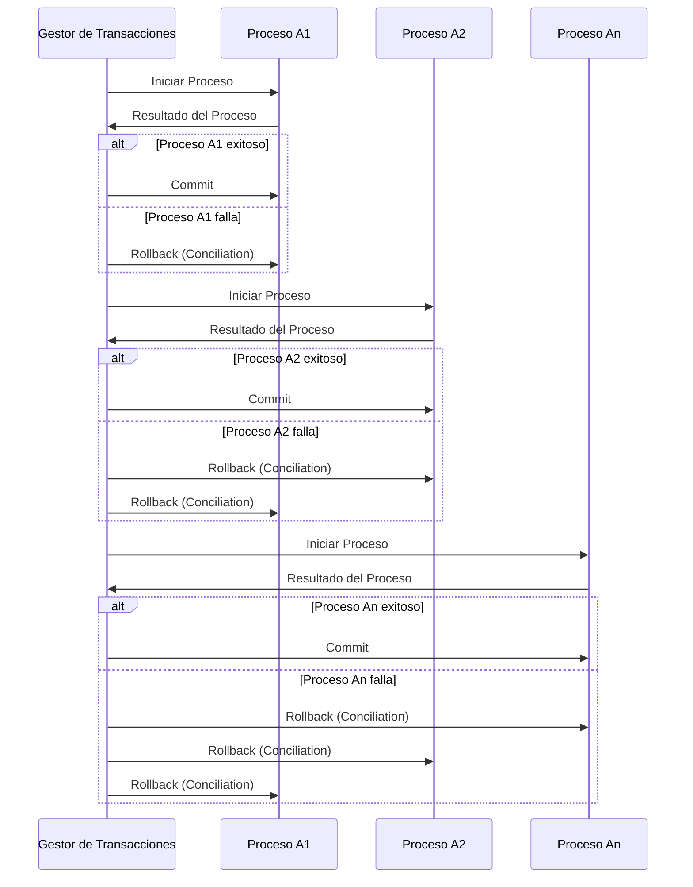

# Semanticas de entrega

En la mensajería, la semántica de entrega se refiere a la garantía de que un mensaje se entregará correctamente a su destino. Dependiendo de la aplicación y del sistema de mensajería utilizado, existen diferentes niveles de garantía de entrega que se pueden ofrecer. Algunas de las semánticas de entrega comunes incluyen:

- [**Como mucho una vez (at-most-once)**](./01-at-most-once-semantic/README.md): El mensaje se entrega una vez o no se entrega en absoluto.

- **Al menos una vez (at-least-once)**: El mensaje se entrega al menos una vez, pero puede haber duplicados.

- **Exactamente una vez (exactly-once)**: El mensaje se entrega exactamente una vez, sin duplicados ni pérdidas.

# Transacciones en Redis

Las transacciones en Redis permiten agrupar un conjunto de comandos en una única operación atómica. Esto significa que todos los comandos en la transacción se ejecutarán como una sola unidad, garantizando que no se interrumpan entre sí. Si alguno de los comandos falla, se deshacen todos los cambios realizados hasta ese momento.

Las transacciones en Redis se pueden iniciar con el comando `MULTI`, seguido de una serie de comandos, y se pueden ejecutar con el comando `EXEC`. También se pueden descartar con el comando `DISCARD`.

# Worker Services en ASP .NET 

Los Worker Services en ASP .NET son una forma de crear aplicaciones de fondo en .NET Core. Estas aplicaciones se ejecutan en segundo plano y pueden realizar tareas como procesamiento de colas, procesamiento de mensajes, tareas de mantenimiento, etc. Los Worker Services son una forma eficiente de ejecutar tareas en segundo plano en .NET Core y se pueden implementar como servicios de Windows, servicios de Linux o contenedores de Docker.

# Referencias

